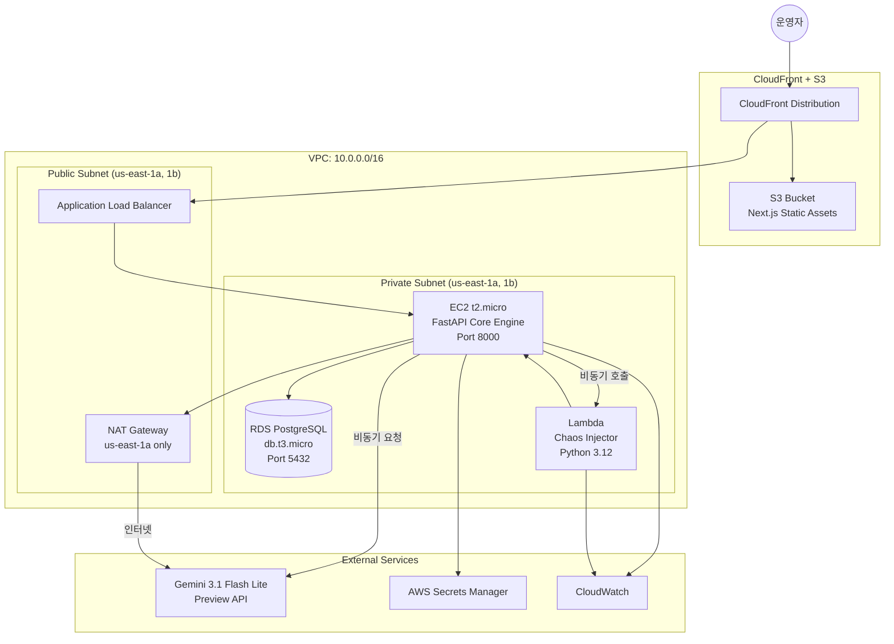
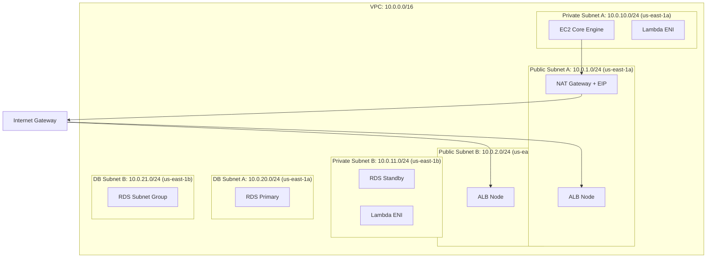
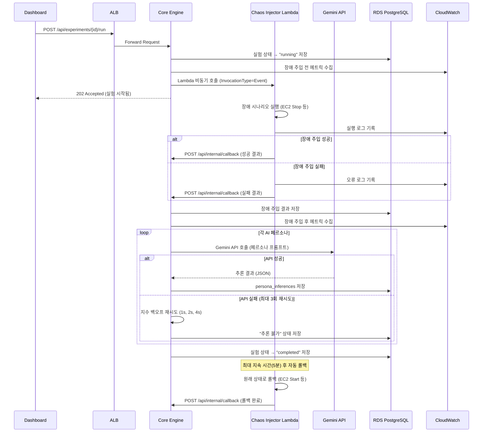
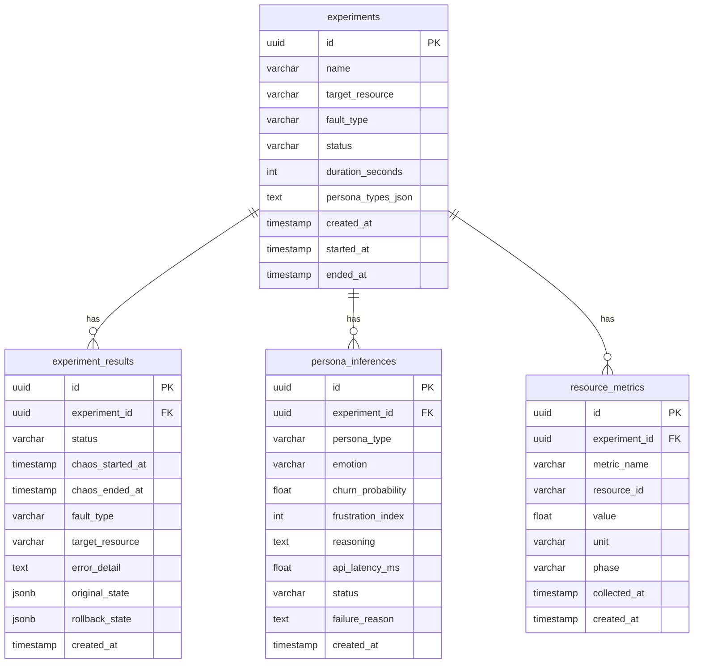
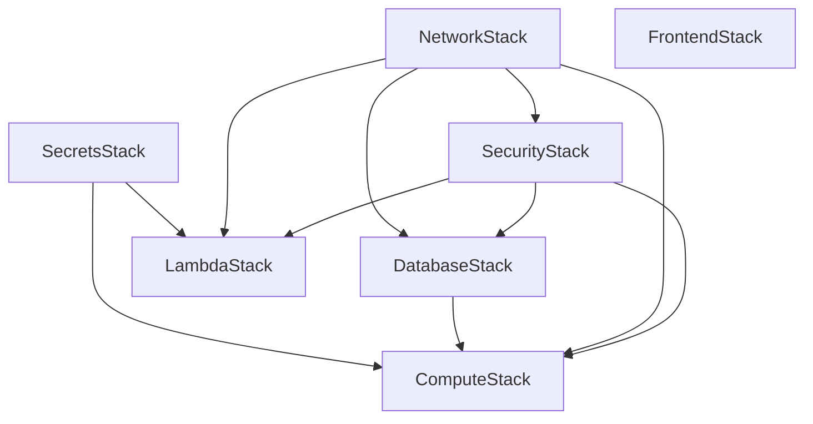

# 기술 설계 문서: AI-Powered Chaos Twin

## 개요 (Overview)

AI-Powered Chaos Twin은 AWS 인프라에 의도적 장애를 주입하고, Gemini AI 기반 페르소나를 통해 사용자 경험(UX) 임계점을 추론하는 카오스 엔지니어링 플랫폼이다.

시스템은 3-Tier + Serverless 하이브리드 아키텍처로 구성된다:
- **Presentation Tier**: Next.js 대시보드 (S3 + CloudFront)
- **Application Tier**: FastAPI Core Engine (EC2) + Chaos Injector (Lambda)
- **Data Tier**: PostgreSQL (RDS)

핵심 워크플로우는 다음과 같다:
1. 운영자가 대시보드에서 Chaos 실험을 생성/실행
2. Core Engine이 Chaos Injector Lambda를 비동기 호출하여 장애 주입
3. 장애 주입 완료 후 AI Reasoning Engine이 Gemini API를 호출하여 페르소나별 심리 상태 추론
4. 추론 결과를 RDS에 저장하고 대시보드에서 시각화

### 설계 원칙

- **최소 권한 원칙**: 각 컴포넌트는 필요한 최소 IAM 권한만 부여
- **비용 최적화**: Free Tier 우선, 단일 NAT Gateway, 단일 AZ RDS
- **안전한 장애 주입**: 자동 롤백, 최대 지속 시간 제한, 단일 리소스 단위 제한
- **비동기 처리**: Lambda 비동기 호출, Gemini API 비동기 요청으로 Core Engine 블로킹 방지

## 아키텍처 (Architecture)

### 시스템 아키텍처 다이어그램



### VPC 네트워크 설계



#### CIDR 할당

| Subnet | CIDR | AZ | 용도 |
|--------|------|----|------|
| Public Subnet A | 10.0.1.0/24 | us-east-1a | ALB, NAT Gateway |
| Public Subnet B | 10.0.2.0/24 | us-east-1b | ALB |
| Private Subnet A | 10.0.10.0/24 | us-east-1a | EC2 Core Engine, Lambda ENI |
| Private Subnet B | 10.0.11.0/24 | us-east-1b | Lambda ENI |
| DB Subnet A | 10.0.20.0/24 | us-east-1a | RDS Primary |
| DB Subnet B | 10.0.21.0/24 | us-east-1b | RDS Subnet Group (HA 대비) |

#### Security Group 설계

| Security Group | 인바운드 규칙 | 아웃바운드 규칙 |
|----------------|--------------|----------------|
| sg-alb | 0.0.0.0/0:80, 0.0.0.0/0:443 | sg-ec2:8000 |
| sg-ec2 | sg-alb:8000 | sg-rds:5432, 0.0.0.0/0:443 (HTTPS) |
| sg-rds | sg-ec2:5432, sg-lambda:5432 | 없음 |
| sg-lambda | 없음 (아웃바운드만) | sg-rds:5432, 0.0.0.0/0:443, sg-ec2:8000 |

#### 라우팅 테이블

- **Public Route Table**: 0.0.0.0/0 → Internet Gateway
- **Private Route Table**: 0.0.0.0/0 → NAT Gateway (us-east-1a)
- **DB Route Table**: 로컬 트래픽만 (인터넷 라우팅 없음)

### 비동기 워크플로우 시퀀스




## 컴포넌트 및 인터페이스 (Components and Interfaces)

### 1. Core Engine (FastAPI) — EC2

Core Engine은 시스템의 중앙 오케스트레이터로, 실험 관리, Lambda 호출, AI 추론 트리거, 메트릭 수집을 담당한다.

#### 모듈 구조

```
core-engine/
├── app/
│   ├── main.py                  # FastAPI 앱 진입점, 라우터 등록
│   ├── config.py                # 설정 관리 (Secrets Manager 연동)
│   ├── routers/
│   │   ├── experiments.py       # 실험 CRUD + 실행 API
│   │   ├── results.py           # 실험 결과 조회 API
│   │   ├── personas.py          # 페르소나 관리 API
│   │   ├── metrics.py           # 메트릭 조회 API
│   │   ├── health.py            # 헬스 체크 엔드포인트
│   │   └── internal.py          # Lambda 콜백 수신 (내부 전용)
│   ├── services/
│   │   ├── experiment_service.py    # 실험 비즈니스 로직
│   │   ├── chaos_service.py         # Lambda 호출 관리
│   │   ├── ai_reasoning_service.py  # Gemini API 호출 + 재시도
│   │   ├── persona_service.py       # 페르소나 프롬프트 구성
│   │   ├── metrics_service.py       # CloudWatch 메트릭 수집
│   │   └── secret_service.py        # Secrets Manager 조회
│   ├── models/
│   │   ├── experiment.py        # SQLAlchemy ORM 모델
│   │   ├── persona_inference.py # AI 추론 결과 모델
│   │   └── resource_metric.py   # 리소스 메트릭 모델
│   ├── schemas/
│   │   ├── experiment.py        # Pydantic 요청/응답 스키마
│   │   ├── persona.py           # 페르소나 스키마
│   │   └── callback.py          # Lambda 콜백 스키마
│   └── db/
│       ├── database.py          # DB 연결 관리
│       └── migrations/          # Alembic 마이그레이션
├── requirements.txt
└── Dockerfile
```

#### 핵심 인터페이스

```python
# services/chaos_service.py
class ChaosService:
    async def invoke_chaos_injector(
        self, experiment_id: str, target_resource: str,
        fault_type: str, duration_seconds: int = 300
    ) -> str:
        """Lambda 비동기 호출. invocation_id 반환."""

    async def handle_callback(
        self, callback: ChaosCallbackSchema
    ) -> None:
        """Lambda 콜백 처리. 결과 저장 + AI 추론 트리거."""

# services/ai_reasoning_service.py
class AIReasoningService:
    async def infer_persona_reaction(
        self, experiment_id: str, persona_type: str,
        fault_context: dict
    ) -> PersonaInferenceResult:
        """Gemini API 호출 (지수 백오프 재시도 포함)."""

    def _build_prompt(
        self, persona_template: str, fault_context: dict
    ) -> str:
        """페르소나 프롬프트 + 장애 컨텍스트 결합."""

# services/experiment_service.py
class ExperimentService:
    async def create_experiment(self, data: ExperimentCreate) -> Experiment:
        """실험 생성."""

    async def run_experiment(self, experiment_id: str) -> None:
        """실험 실행: 파라미터 검증 → Lambda 호출."""

    async def get_experiment_results(
        self, experiment_id: str
    ) -> ExperimentResultDetail:
        """실험 결과 + 페르소나 추론 결과 조회."""
```

### 2. Chaos Injector — Lambda (Python 3.12)

Chaos Injector는 단일 책임 원칙에 따라 장애 주입과 롤백만 수행하는 경량 Lambda 함수이다.

#### 함수 구조

```
chaos-injector/
├── handler.py           # Lambda 핸들러 진입점
├── scenarios/
│   ├── base.py          # 장애 시나리오 추상 클래스
│   ├── ec2_stop.py      # EC2 Stop/Start 시나리오
│   ├── sg_modify.py     # Security Group 포트 차단 시나리오
│   └── rds_delay.py     # RDS 연결 지연 시뮬레이션 시나리오
├── rollback.py          # 자동 롤백 매니저
├── callback.py          # Core Engine 콜백 전송
└── requirements.txt
```

#### Lambda 이벤트 스키마

```json
{
  "experiment_id": "uuid",
  "target_resource": "i-0abc123def456",
  "fault_type": "ec2_stop | sg_port_block | rds_delay",
  "duration_seconds": 300,
  "callback_url": "http://internal-alb-xxx.us-east-1.elb.amazonaws.com:8000/api/internal/callback",
  "rollback_config": {
    "original_state": {}
  }
}
```

#### 장애 시나리오 인터페이스

```python
# scenarios/base.py
class BaseChaosScenario(ABC):
    @abstractmethod
    async def inject(self, target_resource: str, config: dict) -> dict:
        """장애 주입. 롤백에 필요한 원래 상태 반환."""

    @abstractmethod
    async def rollback(self, target_resource: str, original_state: dict) -> None:
        """원래 상태로 롤백."""

# scenarios/ec2_stop.py
class EC2StopScenario(BaseChaosScenario):
    async def inject(self, target_resource: str, config: dict) -> dict:
        """EC2 인스턴스 Stop. 원래 상태(running) 기록."""

    async def rollback(self, target_resource: str, original_state: dict) -> None:
        """EC2 인스턴스 Start."""

# scenarios/sg_modify.py
class SGModifyScenario(BaseChaosScenario):
    async def inject(self, target_resource: str, config: dict) -> dict:
        """Security Group에서 특정 포트 인바운드 규칙 제거."""

    async def rollback(self, target_resource: str, original_state: dict) -> None:
        """원래 Security Group 규칙 복원."""
```

#### Lambda 설정

| 항목 | 값 |
|------|-----|
| Runtime | Python 3.12 |
| Memory | 256MB |
| Timeout | 900초 (15분, 롤백 포함) |
| 동시 실행 제한 | 10 (Reserved Concurrency) |
| VPC 연결 | Private Subnet A, B |
| 호출 방식 | InvocationType=Event (비동기) |

### 3. AI Reasoning Engine / 페르소나 시스템

AI Reasoning Engine은 Core Engine 내부 서비스 모듈로 구현되며, Gemini API와의 통신을 담당한다.

#### 페르소나 프롬프트 템플릿

```python
PERSONA_TEMPLATES = {
    "impatient": {
        "name": "성격 급한 유저",
        "traits": "매우 참을성이 없고, 즉각적인 응답을 기대함",
        "tech_level": "중급",
        "patience_level": "매우 낮음 (3초 이상 대기 시 불만)",
        "expected_response_time": "1초 이내",
        "prompt_template": """
당신은 {name}입니다.
성격 특성: {traits}
기술 숙련도: {tech_level}
인내심 수준: {patience_level}
기대 응답 시간: {expected_response_time}

현재 상황:
- 서비스: {service_name}
- 장애 유형: {fault_type}
- 장애 지속 시간: {fault_duration}초
- 영향 범위: {impact_scope}

위 장애 상황에서 이 사용자의 심리 상태를 분석하세요.
반드시 다음 JSON 형식으로 응답하세요:
{{
  "emotion": "감정 상태 (한국어)",
  "churn_probability": 0.0~1.0,
  "frustration_index": 1~10,
  "reasoning": "추론 근거 (한국어, 2~3문장)"
}}
"""
    },
    "meticulous": {
        "name": "꼼꼼한 유저",
        "traits": "체계적이고 세밀하며, 오류 메시지를 꼼꼼히 읽음",
        "tech_level": "고급",
        "patience_level": "보통 (10초까지 대기 가능)",
        "expected_response_time": "5초 이내",
        "prompt_template": "..."
    },
    "casual": {
        "name": "일반 유저",
        "traits": "가볍게 서비스를 이용하며, 기술적 세부사항에 관심 없음",
        "tech_level": "초급",
        "patience_level": "보통 (5초까지 대기 가능)",
        "expected_response_time": "3초 이내",
        "prompt_template": "..."
    }
}
```

#### Gemini API 호출 흐름

```python
class AIReasoningService:
    MAX_RETRIES = 3
    BACKOFF_BASE = 1  # 초

    async def infer_persona_reaction(
        self, experiment_id: str, persona_type: str, fault_context: dict
    ) -> PersonaInferenceResult:
        template = PERSONA_TEMPLATES[persona_type]
        prompt = self._build_prompt(template["prompt_template"], fault_context)

        for attempt in range(self.MAX_RETRIES):
            try:
                start_time = time.monotonic()
                response = await self._call_gemini(prompt)
                latency_ms = (time.monotonic() - start_time) * 1000

                parsed = self._parse_response(response)
                return PersonaInferenceResult(
                    experiment_id=experiment_id,
                    persona_type=persona_type,
                    emotion=parsed["emotion"],
                    churn_probability=parsed["churn_probability"],
                    frustration_index=parsed["frustration_index"],
                    reasoning=parsed["reasoning"],
                    api_latency_ms=latency_ms,
                )
            except GeminiAPIError:
                if attempt < self.MAX_RETRIES - 1:
                    await asyncio.sleep(self.BACKOFF_BASE * (2 ** attempt))
                    continue
                return PersonaInferenceResult(
                    experiment_id=experiment_id,
                    persona_type=persona_type,
                    status="inference_failed",
                    failure_reason=str(e),
                )
```

### 4. Dashboard (Next.js) — S3 + CloudFront

#### 페이지 구조

```
dashboard/
├── app/
│   ├── layout.tsx                    # 루트 레이아웃 (Sidebar + Header)
│   ├── page.tsx                      # 대시보드 홈 (실험 요약)
│   ├── experiments/
│   │   ├── page.tsx                  # 실험 목록
│   │   ├── new/page.tsx              # 실험 생성 폼
│   │   └── [id]/
│   │       ├── page.tsx              # 실험 상세 정보
│   │       └── results/page.tsx      # 실험 결과 + AI 추론 비교
│   ├── personas/
│   │   └── page.tsx                  # 페르소나 관리
│   └── metrics/
│       └── page.tsx                  # 메트릭 시계열 차트
├── components/
│   ├── experiment-form.tsx           # 실험 생성/편집 폼
│   ├── experiment-status-badge.tsx   # 실험 상태 뱃지
│   ├── persona-comparison-chart.tsx  # 페르소나별 비교 차트
│   ├── metric-timeline-chart.tsx     # 메트릭 시계열 차트
│   └── realtime-status-indicator.tsx # 실시간 상태 표시기
├── lib/
│   ├── api-client.ts                 # Core Engine API 클라이언트
│   └── types.ts                      # TypeScript 타입 정의
└── next.config.js                    # output: 'export' (정적 빌드)
```

#### API 통신

Dashboard는 ALB 엔드포인트를 통해 Core Engine API와 통신한다. 실시간 상태 업데이트는 폴링(5초 간격) 방식으로 구현한다.

```typescript
// lib/api-client.ts
const API_BASE = process.env.NEXT_PUBLIC_API_URL; // ALB DNS

export const apiClient = {
  experiments: {
    list: () => fetch(`${API_BASE}/api/experiments`),
    get: (id: string) => fetch(`${API_BASE}/api/experiments/${id}`),
    create: (data: ExperimentCreate) =>
      fetch(`${API_BASE}/api/experiments`, { method: 'POST', body: JSON.stringify(data) }),
    run: (id: string) =>
      fetch(`${API_BASE}/api/experiments/${id}/run`, { method: 'POST' }),
    delete: (id: string) =>
      fetch(`${API_BASE}/api/experiments/${id}`, { method: 'DELETE' }),
  },
  results: {
    get: (experimentId: string) =>
      fetch(`${API_BASE}/api/experiments/${experimentId}/results`),
  },
  metrics: {
    get: (experimentId: string) =>
      fetch(`${API_BASE}/api/experiments/${experimentId}/metrics`),
  },
};
```

### 5. RESTful API 설계

| Method | Endpoint | 설명 | 요청 Body | 응답 |
|--------|----------|------|-----------|------|
| GET | /api/experiments | 실험 목록 조회 | - | Experiment[] |
| POST | /api/experiments | 실험 생성 | ExperimentCreate | Experiment |
| GET | /api/experiments/{id} | 실험 상세 조회 | - | ExperimentDetail |
| DELETE | /api/experiments/{id} | 실험 삭제 | - | 204 |
| POST | /api/experiments/{id}/run | 실험 실행 | RunConfig | 202 Accepted |
| GET | /api/experiments/{id}/results | 실험 결과 조회 | - | ExperimentResult |
| GET | /api/experiments/{id}/metrics | 실험 메트릭 조회 | - | ResourceMetric[] |
| GET | /api/personas | 페르소나 목록 조회 | - | Persona[] |
| GET | /health | 헬스 체크 | - | {"status": "ok"} |
| POST | /api/internal/callback | Lambda 콜백 (내부) | ChaosCallback | 200 |

#### 주요 스키마

```python
# schemas/experiment.py
class ExperimentCreate(BaseModel):
    name: str
    target_resource: str          # AWS 리소스 ID (e.g., i-0abc123)
    fault_type: Literal["ec2_stop", "sg_port_block", "rds_delay"]
    duration_seconds: int = 300   # 기본 5분
    persona_types: list[Literal["impatient", "meticulous", "casual"]]

class RunConfig(BaseModel):
    persona_types: list[str] | None = None  # 오버라이드 가능

class ChaosCallback(BaseModel):
    experiment_id: str
    status: Literal["success", "failed", "rollback_completed"]
    started_at: datetime
    ended_at: datetime
    target_resource: str
    fault_type: str
    error_detail: str | None = None
    original_state: dict | None = None
```


## 데이터 모델 (Data Models)

### PostgreSQL 스키마



### DDL

```sql
-- experiments: Chaos 실험 정보
CREATE TABLE experiments (
    id UUID PRIMARY KEY DEFAULT gen_random_uuid(),
    name VARCHAR(255) NOT NULL,
    target_resource VARCHAR(255) NOT NULL,
    fault_type VARCHAR(50) NOT NULL CHECK (fault_type IN ('ec2_stop', 'sg_port_block', 'rds_delay')),
    status VARCHAR(50) NOT NULL DEFAULT 'created' CHECK (status IN ('created', 'running', 'completed', 'failed', 'cancelled')),
    duration_seconds INTEGER NOT NULL DEFAULT 300,
    persona_types_json TEXT NOT NULL DEFAULT '["impatient","meticulous","casual"]',
    created_at TIMESTAMP WITH TIME ZONE NOT NULL DEFAULT NOW(),
    started_at TIMESTAMP WITH TIME ZONE,
    ended_at TIMESTAMP WITH TIME ZONE
);

CREATE INDEX idx_experiments_status ON experiments(status);
CREATE INDEX idx_experiments_created_at ON experiments(created_at DESC);

-- experiment_results: 장애 주입 결과
CREATE TABLE experiment_results (
    id UUID PRIMARY KEY DEFAULT gen_random_uuid(),
    experiment_id UUID NOT NULL REFERENCES experiments(id) ON DELETE CASCADE,
    status VARCHAR(50) NOT NULL CHECK (status IN ('success', 'failed', 'rollback_completed')),
    chaos_started_at TIMESTAMP WITH TIME ZONE,
    chaos_ended_at TIMESTAMP WITH TIME ZONE,
    fault_type VARCHAR(50) NOT NULL,
    target_resource VARCHAR(255) NOT NULL,
    error_detail TEXT,
    original_state JSONB,
    rollback_state JSONB,
    created_at TIMESTAMP WITH TIME ZONE NOT NULL DEFAULT NOW()
);

CREATE INDEX idx_experiment_results_experiment_id ON experiment_results(experiment_id);

-- persona_inferences: AI 페르소나 추론 결과
CREATE TABLE persona_inferences (
    id UUID PRIMARY KEY DEFAULT gen_random_uuid(),
    experiment_id UUID NOT NULL REFERENCES experiments(id) ON DELETE CASCADE,
    persona_type VARCHAR(50) NOT NULL CHECK (persona_type IN ('impatient', 'meticulous', 'casual')),
    emotion VARCHAR(100),
    churn_probability FLOAT CHECK (churn_probability >= 0.0 AND churn_probability <= 1.0),
    frustration_index INTEGER CHECK (frustration_index >= 1 AND frustration_index <= 10),
    reasoning TEXT,
    api_latency_ms FLOAT,
    status VARCHAR(50) NOT NULL DEFAULT 'completed' CHECK (status IN ('completed', 'inference_failed')),
    failure_reason TEXT,
    created_at TIMESTAMP WITH TIME ZONE NOT NULL DEFAULT NOW()
);

CREATE INDEX idx_persona_inferences_experiment_id ON persona_inferences(experiment_id);
CREATE INDEX idx_persona_inferences_persona_type ON persona_inferences(persona_type);

-- resource_metrics: 리소스 메트릭
CREATE TABLE resource_metrics (
    id UUID PRIMARY KEY DEFAULT gen_random_uuid(),
    experiment_id UUID NOT NULL REFERENCES experiments(id) ON DELETE CASCADE,
    metric_name VARCHAR(100) NOT NULL,
    resource_id VARCHAR(255) NOT NULL,
    value FLOAT NOT NULL,
    unit VARCHAR(50) NOT NULL,
    phase VARCHAR(20) NOT NULL CHECK (phase IN ('before', 'during', 'after')),
    collected_at TIMESTAMP WITH TIME ZONE NOT NULL,
    created_at TIMESTAMP WITH TIME ZONE NOT NULL DEFAULT NOW()
);

CREATE INDEX idx_resource_metrics_experiment_id ON resource_metrics(experiment_id);
CREATE INDEX idx_resource_metrics_collected_at ON resource_metrics(collected_at);
```

### 설계 결정 사항

1. **JSONB vs 정규화**: `original_state`와 `rollback_state`는 장애 유형별로 구조가 다르므로 JSONB로 저장. 페르소나 유형 목록도 빈번한 조인 없이 조회하기 위해 JSON 텍스트로 저장.
2. **UUID PK**: 분산 환경에서의 충돌 방지 및 보안(순차 ID 추측 방지)을 위해 UUID 사용.
3. **CHECK 제약 조건**: `fault_type`, `status`, `persona_type` 등 열거형 값에 CHECK 제약 조건을 적용하여 데이터 무결성 보장.
4. **CASCADE 삭제**: 실험 삭제 시 관련 결과, 추론, 메트릭 데이터를 함께 삭제.
5. **phase 컬럼**: 메트릭을 장애 주입 전/중/후로 구분하여 변화량 비교 용이.


## 정확성 속성 (Correctness Properties)

*정확성 속성(Property)은 시스템의 모든 유효한 실행에서 참이어야 하는 특성 또는 동작이다. 속성은 사람이 읽을 수 있는 명세와 기계가 검증할 수 있는 정확성 보장 사이의 다리 역할을 한다.*

### Property 1: 장애 요청 안전 검증

*For any* 장애 주입 요청에 대해, fault_type이 허용 목록(`ec2_stop`, `sg_port_block`, `rds_delay`)에 없거나 다중 리소스를 대상으로 하는 요청은 항상 거부되어야 한다.

**Validates: Requirements 2.2, 2.3**

### Property 2: 예외 시 에러 콜백 생성

*For any* Chaos Injector 실행 중 발생하는 예외에 대해, 생성되는 콜백 페이로드는 항상 `status: "failed"`와 비어있지 않은 `error_detail`을 포함해야 한다.

**Validates: Requirements 2.7**

### Property 3: 롤백 상태 복원 라운드트립

*For any* 유효한 장애 시나리오와 원래 리소스 상태에 대해, `inject`로 기록된 `original_state`를 `rollback`에 전달하면 원래 상태를 복원하는 올바른 AWS API 호출이 생성되어야 한다.

**Validates: Requirements 2.8**

### Property 4: Gemini 응답 파싱 및 범위 검증

*For any* 유효한 Gemini API JSON 응답에 대해, 파싱 결과는 항상 `emotion`(비어있지 않은 문자열), `churn_probability`(0.0~1.0), `frustration_index`(1~10), `reasoning`(비어있지 않은 문자열) 필드를 포함하고 각 값이 지정된 범위 내에 있어야 한다.

**Validates: Requirements 3.2, 4.4**

### Property 5: 지수 백오프 재시도 간격

*For any* 연속 실패 시퀀스(1~3회)에 대해, n번째 재시도 전 대기 시간은 항상 `BACKOFF_BASE * 2^(n-1)` 초(1초, 2초, 4초)를 따라야 한다.

**Validates: Requirements 3.5**

### Property 6: API 지연 시간 측정 양수성

*For any* 성공적인 Gemini API 호출에 대해, 측정된 `api_latency_ms` 값은 항상 0보다 크고 추론 결과에 포함되어야 한다.

**Validates: Requirements 3.7**

### Property 7: 프롬프트 구성 완전성

*For any* 페르소나 유형과 장애 컨텍스트 조합에 대해, 생성된 프롬프트 문자열은 항상 해당 페르소나의 성격 특성, 기술 숙련도, 인내심 수준, 기대 응답 시간과 장애 컨텍스트의 서비스명, 장애 유형, 지속 시간을 모두 포함해야 한다.

**Validates: Requirements 4.2, 4.3**

### Property 8: 다중 페르소나 독립 저장

*For any* 페르소나 유형 목록에 대해, 실험 실행 후 저장된 `persona_inferences` 레코드 수는 페르소나 수와 동일하고, 각 레코드는 고유한 `persona_type`을 가져야 한다.

**Validates: Requirements 4.5**

### Property 9: 실험 파라미터 검증 및 에러 응답

*For any* 무효한 실험 파라미터(존재하지 않는 리소스 ID, 허용되지 않는 fault_type, 빈 페르소나 목록 등)에 대해, Core Engine은 항상 HTTP 400 응답과 함께 구체적인 검증 실패 사유를 포함하는 에러 메시지를 반환해야 한다.

**Validates: Requirements 5.5, 5.6**

### Property 10: 메트릭 phase 구분 정확성

*For any* 메트릭 수집 시점(장애 주입 전, 중, 후)에 대해, 저장된 `resource_metrics` 레코드의 `phase` 값은 항상 수집 시점에 대응하는 올바른 값(`before`, `during`, `after`)을 가져야 한다.

**Validates: Requirements 9.2**


## 에러 처리 (Error Handling)

### 계층별 에러 처리 전략

| 계층 | 에러 유형 | 처리 방식 |
|------|----------|----------|
| **Chaos Injector Lambda** | AWS API 호출 실패 | CloudWatch 로그 기록 + Core Engine에 `failed` 콜백 전송 + 자동 롤백 시도 |
| **Chaos Injector Lambda** | 타임아웃 (15분 초과) | Lambda 런타임이 강제 종료. EventBridge 규칙으로 미완료 실험 감지 후 롤백 |
| **AI Reasoning Engine** | Gemini API 호출 실패 | 지수 백오프 재시도 (1s, 2s, 4s). 3회 실패 시 `inference_failed` 상태 저장 |
| **AI Reasoning Engine** | Gemini 응답 파싱 실패 | `inference_failed` 상태 저장 + 원본 응답을 `failure_reason`에 기록 |
| **Core Engine API** | 파라미터 검증 실패 | HTTP 400 + 구체적 검증 실패 사유 JSON 반환 |
| **Core Engine API** | DB 연결 실패 | HTTP 503 + 재시도 안내. SQLAlchemy 연결 풀 자동 재연결 |
| **Core Engine API** | Lambda 호출 실패 | HTTP 502 + 실험 상태를 `failed`로 업데이트 |
| **Core Engine** | Secrets Manager 조회 실패 | 서비스 시작 중단 + 오류 로깅 |
| **Dashboard** | API 통신 실패 | 사용자에게 에러 토스트 표시 + 자동 재시도 (폴링 유지) |

### 롤백 안전망

```
1차: Chaos Injector 내부 자동 롤백 (duration_seconds 초과 시)
2차: Core Engine 타임아웃 감지 (5분 내 콜백 미수신 시 Lambda 재호출로 롤백)
3차: 수동 롤백 API (운영자가 대시보드에서 강제 롤백 실행)
```

### FastAPI 글로벌 예외 핸들러

```python
@app.exception_handler(ValidationError)
async def validation_error_handler(request, exc):
    return JSONResponse(status_code=400, content={
        "error": "validation_failed",
        "details": exc.errors()
    })

@app.exception_handler(ExperimentNotFoundError)
async def not_found_handler(request, exc):
    return JSONResponse(status_code=404, content={
        "error": "not_found",
        "message": str(exc)
    })

@app.exception_handler(Exception)
async def general_error_handler(request, exc):
    logger.error(f"Unhandled error: {exc}", exc_info=True)
    return JSONResponse(status_code=500, content={
        "error": "internal_error",
        "message": "An unexpected error occurred"
    })
```

## 테스트 전략 (Testing Strategy)

### PBT 적용 평가

이 프로젝트는 PBT가 적합한 순수 로직 컴포넌트를 다수 포함한다:
- 입력 검증 로직 (fault_type, 실험 파라미터)
- JSON 파싱 및 범위 검증
- 프롬프트 구성 로직
- 재시도 간격 계산
- 롤백 상태 생성

반면, IaC 구성(VPC, Security Group 등), UI 렌더링(Dashboard), 외부 서비스 연동(Lambda 호출, CloudWatch)은 PBT 부적합하므로 스냅샷 테스트, 예제 기반 테스트, 통합 테스트를 사용한다.

### 이중 테스트 접근법

#### 1. Property-Based Tests (pytest + Hypothesis)

- 라이브러리: **Hypothesis** (Python)
- 최소 100회 반복 실행
- 각 테스트에 설계 문서 속성 참조 태그 포함

```python
# 태그 형식 예시
# Feature: ai-powered-chaos-twin, Property 1: 장애 요청 안전 검증

@given(fault_type=st.text(), target_resources=st.lists(st.text(), min_size=1))
def test_chaos_request_safety_validation(fault_type, target_resources):
    """Feature: ai-powered-chaos-twin, Property 1: 장애 요청 안전 검증"""
    ...
```

| Property | 테스트 대상 | 생성기 |
|----------|-----------|--------|
| Property 1 | `validate_chaos_request()` | 임의 문자열 fault_type + 리소스 목록 |
| Property 2 | `build_error_callback()` | 임의 Exception 유형 |
| Property 3 | `inject()` → `rollback()` | 임의 리소스 상태 dict |
| Property 4 | `parse_gemini_response()` | 유효한 JSON 구조 생성 |
| Property 5 | `calculate_backoff()` | 1~3 범위 정수 |
| Property 6 | `infer_persona_reaction()` (모킹) | 임의 응답 지연 |
| Property 7 | `build_prompt()` | 임의 페르소나 + 장애 컨텍스트 |
| Property 8 | `run_all_personas()` (모킹) | 임의 페르소나 목록 |
| Property 9 | `validate_experiment_params()` | 임의 실험 파라미터 |
| Property 10 | `collect_and_store_metrics()` (모킹) | 임의 메트릭 값 + 시점 |

#### 2. Unit Tests (pytest)

- 특정 예제 및 엣지 케이스 검증
- Gemini API 3회 실패 후 `inference_failed` 상태 저장 (요구사항 3.6)
- Secrets Manager 조회 실패 시 서비스 시작 중단 (요구사항 7.5)
- 5분 초과 시 자동 롤백 트리거 (요구사항 9.5)
- Lambda 콜백 페이로드 형식 검증 (요구사항 2.6)

#### 3. Integration Tests

- Core Engine API CRUD 엔드포인트 (요구사항 5.1)
- Lambda 비동기 호출 트리거 (요구사항 2.1, 5.2)
- RDS 데이터 저장/조회 라운드트립 (요구사항 5.4)
- 헬스 체크 엔드포인트 (요구사항 11.5)

#### 4. IaC Snapshot Tests

- VPC, Subnet, Security Group 구성 (요구사항 1.x)
- Lambda 설정 (메모리, 타임아웃, VPC 연결) (요구사항 8.4)
- EC2, RDS 인스턴스 타입 (요구사항 8.2, 8.5)
- IAM Role 최소 권한 정책 (요구사항 7.4)

#### 5. Frontend Tests (Jest + React Testing Library)

- 컴포넌트 렌더링 테스트 (요구사항 6.1~6.3)
- API 클라이언트 모킹 테스트 (요구사항 6.6)
- 폴링 기반 실시간 업데이트 테스트 (요구사항 6.5)

### 보안 설계 (Security Design)

#### IAM Role 설계

| Role | 연결 대상 | 권한 |
|------|----------|------|
| `ChaosEngineEC2Role` | EC2 Core Engine | Lambda:InvokeFunction, SecretsManager:GetSecretValue, CloudWatch:GetMetricData, CloudWatch:PutMetricData, RDS 접근 (SG 기반) |
| `ChaosInjectorLambdaRole` | Lambda Chaos Injector | EC2:StopInstances, EC2:StartInstances, EC2:DescribeInstances, EC2:AuthorizeSecurityGroupIngress, EC2:RevokeSecurityGroupIngress, EC2:DescribeSecurityGroups, CloudWatch:PutLogEvents |
| `DashboardCloudFrontRole` | CloudFront OAI | S3:GetObject (대시보드 버킷만) |

#### Secrets Manager 구성

```
Secret Name: chaos-twin/gemini-api-key
Secret Value: {"api_key": "<GEMINI_API_KEY>"}
Rotation: 수동 (필요 시)
Access: ChaosEngineEC2Role만 GetSecretValue 허용
```

#### 네트워크 보안

- Core Engine EC2는 Private Subnet에 배치, ALB를 통해서만 접근 가능
- RDS는 DB Subnet에 배치, EC2와 Lambda SG에서만 접근 가능
- Lambda는 VPC 내 Private Subnet에 ENI 생성, NAT Gateway를 통해 Gemini API 호출
- 모든 외부 통신은 HTTPS(443) 사용

### IaC 구조 (Infrastructure as Code)

AWS CDK (TypeScript) 기반으로 전체 인프라를 정의한다.

```
infra/
├── bin/
│   └── chaos-twin.ts              # CDK 앱 진입점
├── lib/
│   ├── stacks/
│   │   ├── network-stack.ts       # VPC, Subnet, NAT Gateway, IGW
│   │   ├── security-stack.ts      # Security Groups, IAM Roles
│   │   ├── compute-stack.ts       # EC2, ALB, Target Group
│   │   ├── database-stack.ts      # RDS PostgreSQL
│   │   ├── lambda-stack.ts        # Chaos Injector Lambda
│   │   ├── frontend-stack.ts      # S3, CloudFront
│   │   └── secrets-stack.ts       # Secrets Manager
│   └── constructs/
│       ├── fastapi-ec2.ts         # EC2 + User Data 커스텀 구성
│       └── chaos-lambda.ts        # Lambda + 패키징 커스텀 구성
├── test/
│   └── snapshot/                  # IaC 스냅샷 테스트
├── cdk.json
├── tsconfig.json
└── package.json
```

#### 스택 의존성



#### 배포 명령

```bash
# 전체 인프라 배포
cd infra && npx cdk deploy --all

# 개별 스택 배포
npx cdk deploy NetworkStack SecurityStack DatabaseStack ComputeStack LambdaStack FrontendStack SecretsStack

# 대시보드만 업데이트
cd dashboard && npm run build && aws s3 sync out/ s3://<bucket-name> && aws cloudfront create-invalidation --distribution-id <id> --paths "/*"
```

